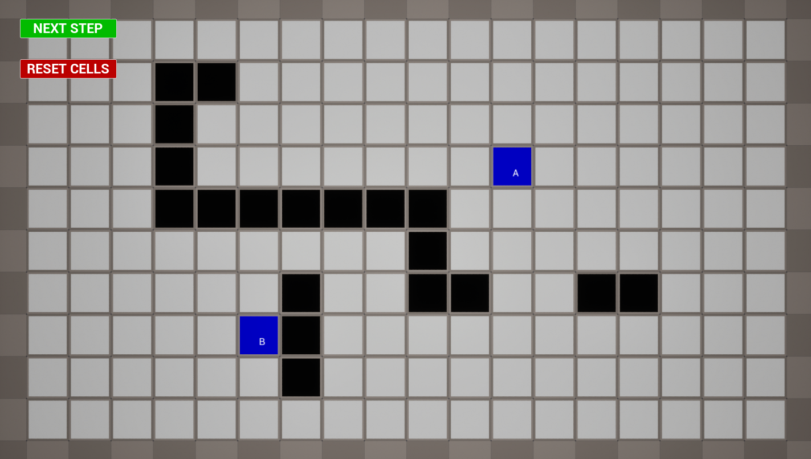
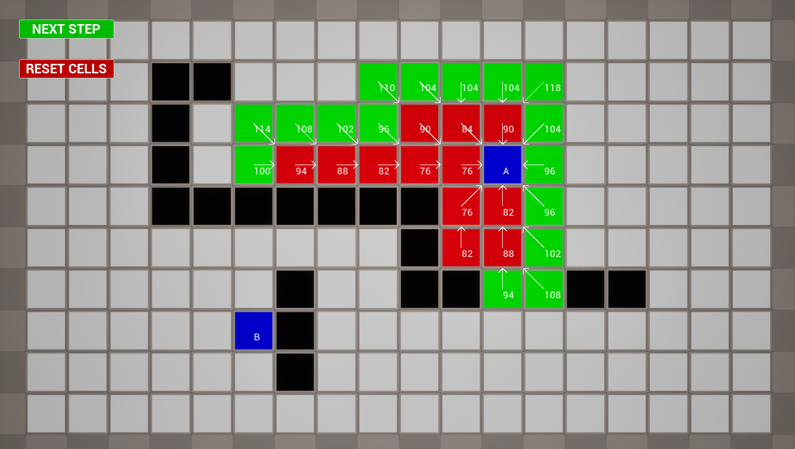
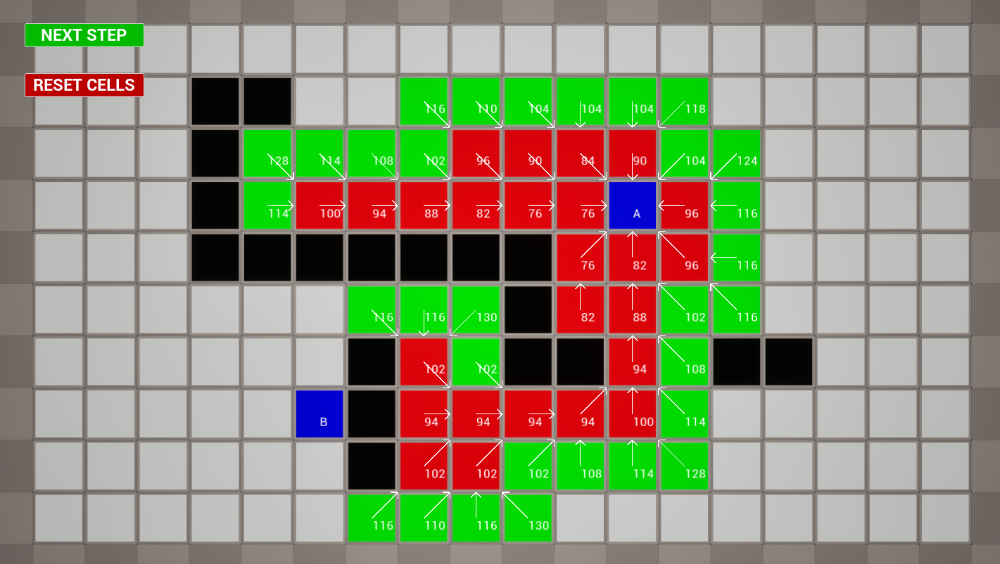
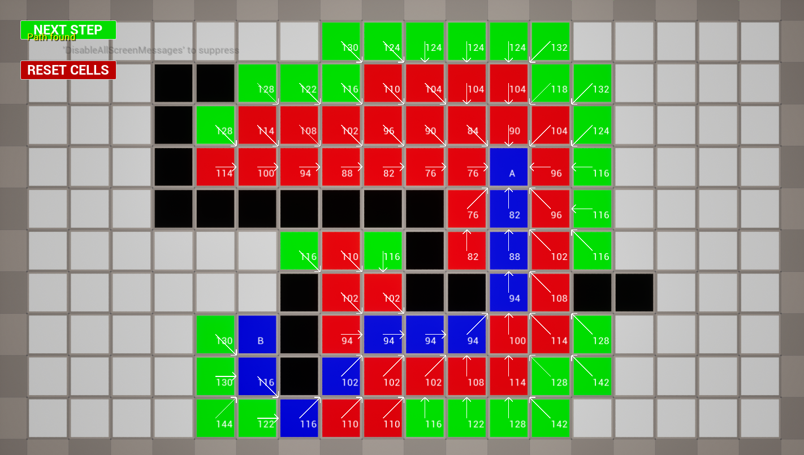

# A* Pathfinding Project in Unreal Engine 5

## Project Description
This project implements the A* pathfinding algorithm in Unreal Engine 5 via an actor component (`UPathFinding`). The algorithm calculates the shortest path between two points in a grid while avoiding obstacles, using weighted cells and distance heuristics.

## Key Features
- **Grid of Cells**: Configurable in terms of size and dimensions.
- **Optimal Path Detection**: Uses distance weighting to find the shortest path.
- **Path Visualization**: Cells change color based on their status (start, destination, wall, visited cell, etc.).
- **Obstacle Support**: Ability to define wall cells that block the path.
- **Real-Time Operation**: Can be activated with step-by-step iterations to observe the progressive path calculation.

## Quick Start
1. Generate project files, compile the code, and press play in the editor.
2. **Left Click**: Toggle wall cells.
3. **Right Click**: Toggle the start and end cell positions.
4. Click on "NEXT STEP" to observe the progressive path calculation.
5. Click on "RESET CELLS" to clear the grid and reset the algorithm.

## Project Structure
- **PathFinding.h**: Declaration of the `UPathFinding` class and its members, along with public and private functions required for the A* algorithm.
- **PathFinding.cpp**: Implementation of functions, including cell initialization, distance calculations, cell selection, and cell management methods such as `ToggleWall`, `ToggleBeginEnd`, and `NextIteration`.

## Usage Guide

### Initialization
- **Grid Dimensions**: In the Unreal Editor, set `HorizontalCells`, `VerticalCells`, and `CellSize` properties to configure the grid.
- **Setting Start and End Points**: Use `ToggleBeginEnd` by clicking on two points to define the start and end cells.
- **Adding Walls**: Use the `ToggleWall` function to add obstacles to specific cells in the grid.

### Running the Algorithm
1. **Start Iteration**: Call `NextIteration` to compute the path step by step.
2. **Resetting**: If needed, use `ResetCells` to clear the grid and reset the algorithm.

### Visualization
- Cells take on different colors to indicate their status:
  - **White**: Unvisited cell.
  - **Black**: Wall.
  - **Green**: Weighted cell.
  - **Red**: Cell being processed.
  - **Blue**: Final path.
- Arrows and text labels help visualize relationships between cells and their weights.

## Configuration and Installation
1. Add `PathFinding.cpp` and `PathFinding.h` files to your Unreal Engine 5 project.
2. Ensure that the `UPathFinding` component is attached to the desired actor.
3. Compile the project and adjust the parameters in the Unreal Editor.

## Potential Improvements
- **Optimization with Priority Queues**: For more efficient calculation of weighted cells.
- **Customizable Heuristic**: Adjust the distance heuristic to adapt the algorithm to different types of terrain.
- **User Interface**: Add an interface to simplify interaction with the grid and pathfinding settings.

## License
This project is intended for learning purposes and is free for personal and educational use.

## Visualization

The following images show how the A* pathfinding grid updates:

